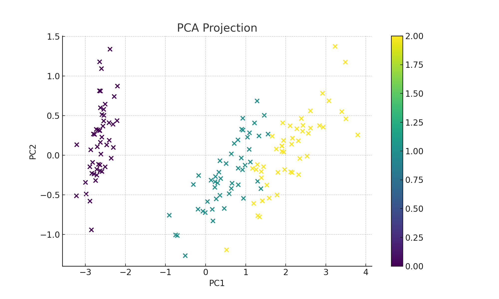
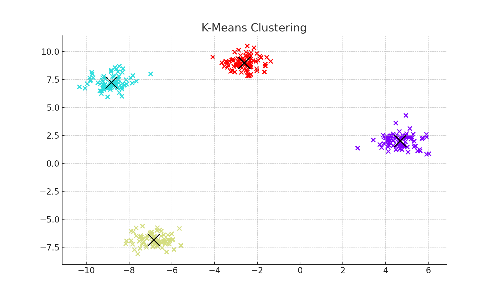
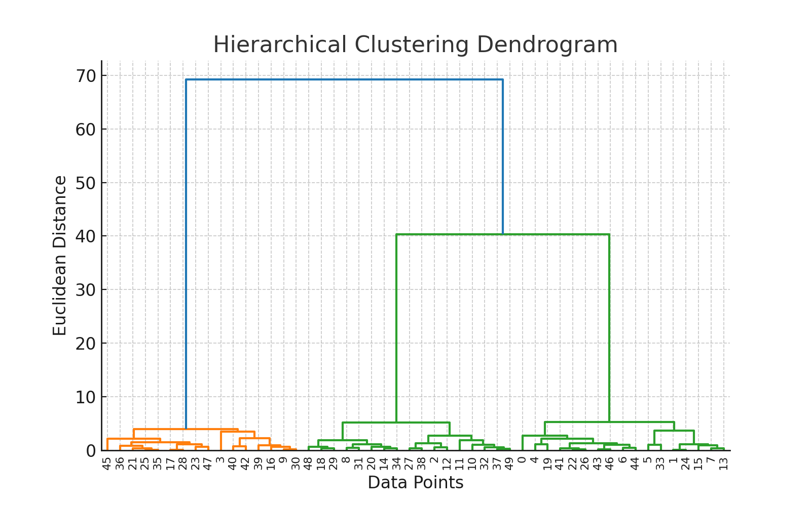
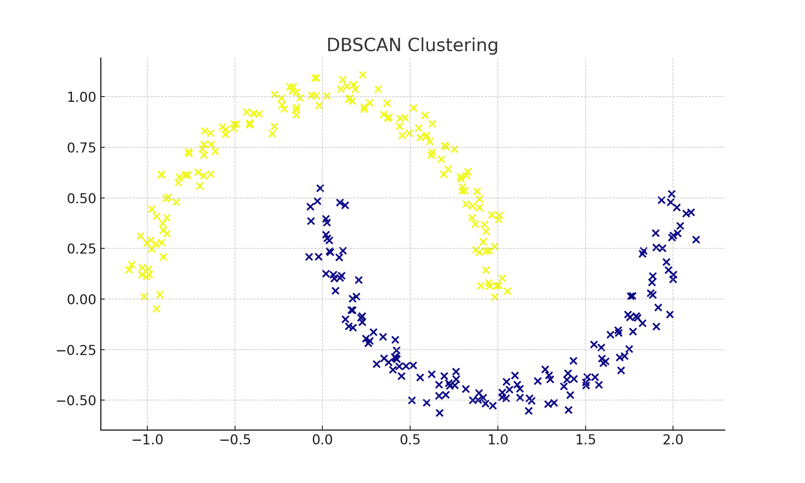
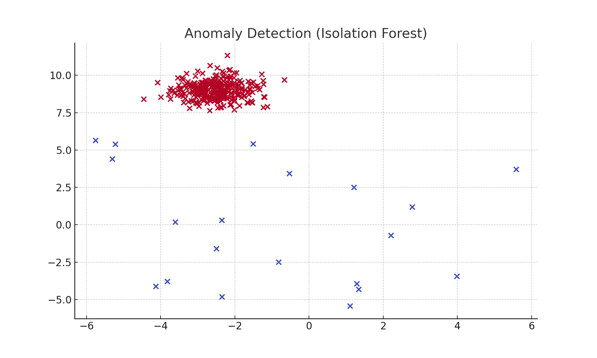

# 📘 Unsupervised Learning - Algorithms, Math Intuition, Code & Visuals

This repository contains explanations, mathematical intuition, sample Python implementations, and **visualizations** for key **unsupervised learning algorithms** along with **Silhouette Scoring**.

---

## 📑 Index

1. [Principal Component Analysis (PCA)](#1-principal-component-analysis-pca)  
2. [K-Means Clustering](#2-k-means-clustering)  
3. [Hierarchical Clustering](#3-hierarchical-clustering)  
4. [DBSCAN Clustering](#4-dbscan-clustering)  
5. [Anomaly Detection](#5-anomaly-detection)  
6. [Silhouette Scoring](#6-silhouette-scoring)

---

## 1. Principal Component Analysis (PCA)

**Purpose:** Dimensionality reduction while preserving maximum variance.

### Math Steps
1. Standardize data  
2. Compute covariance matrix  
3. Perform eigen decomposition  
4. Select top-k eigenvectors (principal components)  
5. Transform data  

### Python Example
```python
import numpy as np
import matplotlib.pyplot as plt
from sklearn.decomposition import PCA
from sklearn.datasets import load_iris

# Load sample data
data = load_iris()
X = data.data

# Apply PCA
pca = PCA(n_components=2)
X_pca = pca.fit_transform(X)

# Plot
plt.scatter(X_pca[:, 0], X_pca[:, 1], c=data.target, cmap='viridis')
plt.xlabel('PC1')
plt.ylabel('PC2')
plt.title('PCA Projection')
plt.colorbar()
plt.show()
```

**Visualization:**  


---

## 2. K-Means Clustering

**Purpose:** Partition data into `k` clusters based on centroid distances.

### Python Example
```python
from sklearn.cluster import KMeans
from sklearn.datasets import make_blobs
import matplotlib.pyplot as plt

# Generate synthetic data
X, _ = make_blobs(n_samples=300, centers=4, cluster_std=0.6, random_state=42)

# KMeans
kmeans = KMeans(n_clusters=4, n_init=10)
y_kmeans = kmeans.fit_predict(X)

# Plot
plt.scatter(X[:, 0], X[:, 1], c=y_kmeans, cmap='rainbow')
plt.scatter(kmeans.cluster_centers_[:, 0], kmeans.cluster_centers_[:, 1], s=300, c='black', marker='x')
plt.title('K-Means Clustering')
plt.show()
```

**Visualization:**  


---

## 3. Hierarchical Clustering

**Purpose:** Build clusters in a hierarchical tree structure (dendrogram).

### Python Example
```python
import scipy.cluster.hierarchy as sch
from sklearn.datasets import make_blobs
import matplotlib.pyplot as plt

# Data
X, _ = make_blobs(n_samples=50, centers=3, random_state=42)

# Dendrogram
plt.figure(figsize=(8, 5))
sch.dendrogram(sch.linkage(X, method='ward'))
plt.title('Hierarchical Clustering Dendrogram')
plt.xlabel('Data Points')
plt.ylabel('Euclidean Distance')
plt.show()
```

**Visualization:**  


---

## 4. DBSCAN Clustering

**Purpose:** Density-based clustering for arbitrary shapes, detecting outliers.

### Python Example
```python
from sklearn.cluster import DBSCAN
from sklearn.datasets import make_moons
import matplotlib.pyplot as plt

# Generate data
X, _ = make_moons(n_samples=300, noise=0.05, random_state=42)

# DBSCAN
dbscan = DBSCAN(eps=0.2, min_samples=5)
labels = dbscan.fit_predict(X)

# Plot
plt.scatter(X[:, 0], X[:, 1], c=labels, cmap='plasma')
plt.title('DBSCAN Clustering')
plt.show()
```

**Visualization:**  


---

## 5. Anomaly Detection

**Purpose:** Identify rare/unusual patterns.

### Example: Isolation Forest
```python
from sklearn.ensemble import IsolationForest
from sklearn.datasets import make_blobs
import matplotlib.pyplot as plt
import numpy as np

# Data
X, _ = make_blobs(n_samples=300, centers=1, cluster_std=0.6, random_state=42)

# Add anomalies
rng = np.random.RandomState(42)
X_outliers = rng.uniform(low=-6, high=6, size=(20, 2))
X_combined = np.vstack((X, X_outliers))

# Isolation Forest
iso = IsolationForest(contamination=0.06, random_state=42)
y_pred = iso.fit_predict(X_combined)

# Plot
plt.scatter(X_combined[:, 0], X_combined[:, 1], c=y_pred, cmap='coolwarm')
plt.title('Anomaly Detection (Isolation Forest)')
plt.show()
```

**Visualization:**  


---

## 6. Silhouette Scoring

**Purpose:** Evaluate cluster quality without labels.

### Math Formula:
\[
s(i) = \frac{b(i) - a(i)}{\max(a(i), b(i))}
\]
- \( a(i) \): avg. distance within same cluster  
- \( b(i) \): min avg. distance to other clusters  

### Python Example
```python
from sklearn.metrics import silhouette_score

# Using KMeans example data
score = silhouette_score(X, y_kmeans)
print(f"Silhouette Score: {score:.3f}")
```

**Silhouette Score for KMeans Example:**  
```
0.876
```

---

## 📌 Summary Table

| Algorithm | Purpose | Best For | Parameters |
|-----------|---------|----------|------------|
| PCA | Dimensionality reduction | Correlated features | n_components |
| K-Means | Partition into k clusters | Spherical clusters | k |
| Hierarchical | Tree clustering | Nested clusters | Linkage type |
| DBSCAN | Density-based | Arbitrary shapes | eps, min_samples |
| Anomaly Detection | Outlier detection | Rare patterns | Model-specific |

---

## 📚 References

- [scikit-learn Documentation](https://scikit-learn.org)
- Bishop, C. M. *Pattern Recognition and Machine Learning*
- Hastie, T., Tibshirani, R., Friedman, J. *The Elements of Statistical Learning*
